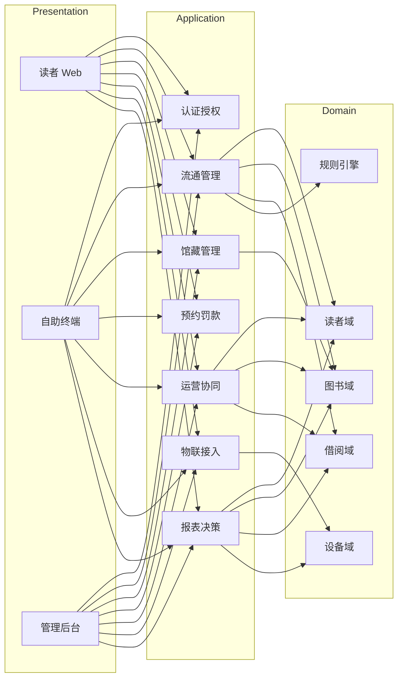
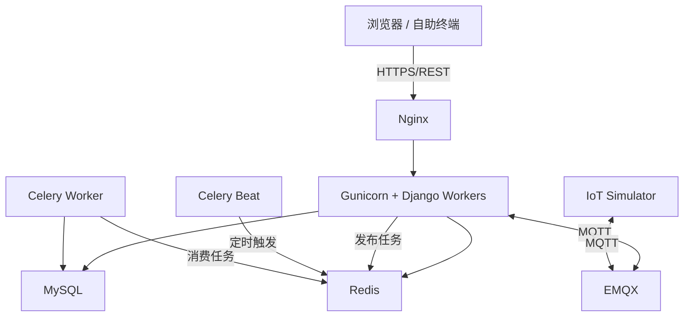
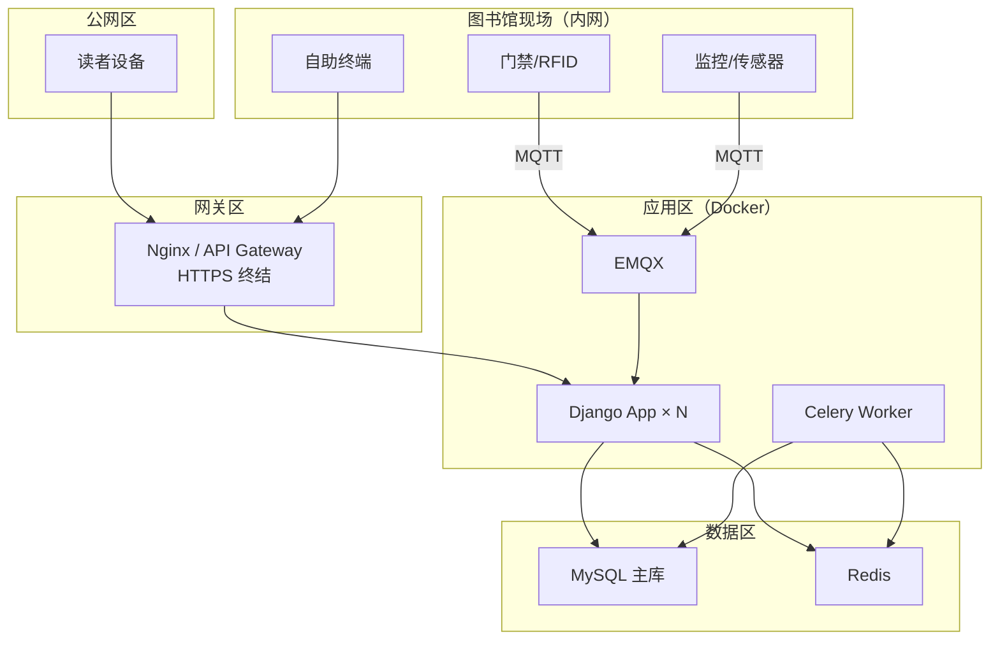
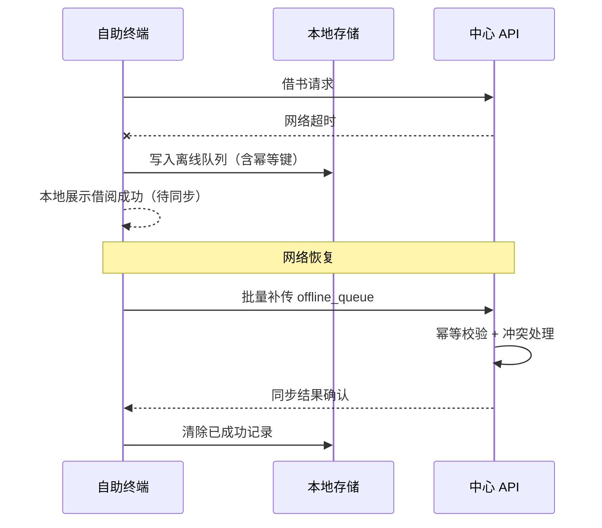
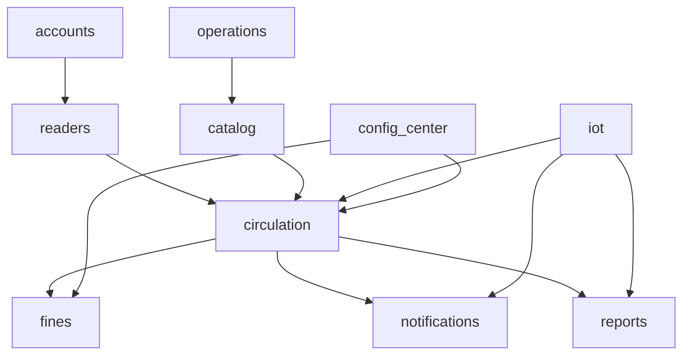
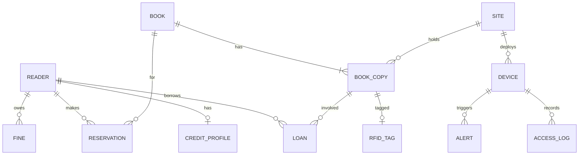

# 无人值守图书馆系统 — 架构设计文档

| 项目名称 | 无人值守图书馆系统（管理系统 + 运营支撑） |
| --- | --- |
| 文档版本 | V1.0 |
| 编写日期 | 2026-09-20 |
| 文档状态 | 初稿（待评审） |
| 编制依据 | 《无人值守图书馆系统 — 需求文档（融合版）》V2.0 |

---

## 1 引言

### 1.1 编写目的

本架构设计文档在需求文档 V2.0 基础上，描述无人值守图书馆系统的**总体架构、参考模型、参考架构、质量场景、技术框架与设计模式**，并给出**优先级划分与实施路线**，作为开发、测试、部署与架构评审的依据。

### 1.2 读者对象

- 开发团队（后端、前端、物联接入）
- 架构评审老师与项目评审人员
- 运维与设备维护人员
- 馆方管理者

### 1.3 术语与缩写

| 术语 | 说明 |
| --- | --- |
| B/S | Browser/Server，浏览器/服务器架构 |
| RBAC | 基于角色的访问控制 |
| MQTT | 轻量级物联网消息协议 |
| DRF | Django REST Framework |
| JWT | JSON Web Token，无状态鉴权令牌 |
| EMQX | MQTT 消息 broker（本期用于设备模拟） |

### 1.4 设计原则

1. **业务闭环优先**：先实现"能开门、能借还、保安全、可运维、可合规"。
2. **分层解耦**：表现层、应用层、领域层、基础设施层职责清晰。
3. **质量驱动**：以性能、可用性、安全性、可维护性场景指导技术选型。
4. **可演进**：基础层稳定交付，进阶层通过标准接口与模块插件扩展。
5. **仿真可演示**：硬件以 MQTT 模拟接入，保证课设可运行、可验收。

---

## 2 架构概述

### 2.1 系统定位

无人值守图书馆系统是一套 **B/S 架构的多端协同平台**，面向读者自助服务、馆员后台管理、设备远程运维三类场景，通过 **Web 前端 + Django 后端 + MySQL/Redis + MQTT 物联层** 实现 7×24 无人值守借还与运营支撑。

### 2.2 总体架构图

```mermaid
flowchart TB
    subgraph Client["客户端层"]
        WEB["读者 Web 端<br/>Vue 3 + Element Plus"]
        KIOSK["自助终端 Web<br/>（触摸屏/Kiosk 模式）"]
        ADMIN["管理后台<br/>Django Admin + Vue"]
    end

    subgraph Gateway["接入层"]
        NGINX["Nginx 反向代理 / 静态资源 / HTTPS"]
        API["REST API 网关<br/>JWT 鉴权 / 限流"]
    end

    subgraph App["应用服务层（Django）"]
        AUTH["认证授权模块"]
        READER["读者与信用模块"]
        CIRC["流通借还模块"]
        CATALOG["馆藏与检索模块"]
        RESERVE["预约与罚款模块"]
        OPS["运营协同模块"]
        IOT_SVC["物联接入服务"]
        NOTIFY["消息通知模块"]
        REPORT["报表与决策模块"]
    end

    subgraph Domain["领域与公共层"]
        RULE["借阅规则引擎"]
        AUDIT["审计日志"]
        EVENT["领域事件总线"]
    end

    subgraph Infra["基础设施层"]
        MYSQL[(MySQL 主库)]
        REDIS[(Redis 缓存/会话/队列)]
        CELERY["Celery 定时任务"]
        MQTT["EMQX MQTT Broker"]
    end

    subgraph Device["物联设备层（模拟/仿真）"]
        RFID["RFID 读写器"]
        DOOR["门禁闸机"]
        CAM["监控摄像头"]
        SENSOR["温湿度传感器"]
        ALARM["烟感/求助按钮"]
    end

    WEB --> NGINX
    KIOSK --> NGINX
    ADMIN --> NGINX
    NGINX --> API
    API --> AUTH & READER & CIRC & CATALOG & RESERVE & OPS & IOT_SVC & NOTIFY & REPORT
    AUTH & READER & CIRC & CATALOG & RESERVE & OPS & IOT_SVC & NOTIFY & REPORT --> RULE & AUDIT & EVENT
    App --> MYSQL & REDIS & CELERY
    IOT_SVC <-->|MQTT Pub/Sub| MQTT
    MQTT <-- RFID & DOOR & CAM & SENSOR & ALARM
```

### 2.3 架构关键决策摘要

| 决策项 | 选择 | 理由 |
| --- | --- | --- |
| 总体风格 | **分层架构 + 前后端分离** | 符合 B/S 约束，团队分工清晰，便于课设演示 |
| 物联接入 | **MQTT + 设备适配器** | 解耦硬件协议，模拟与真实设备可替换 |
| 数据存储 | **MySQL + Redis** | 事务一致性 + 缓存/会话/限流 |
| 异步任务 | **Celery** | 逾期计算、消息推送、报表生成 |
| 鉴权方式 | **JWT + RBAC** | 无状态、适合多端与水平扩展 |
| 部署方式 | **Docker 容器化** | 内网/公网网关统一部署 |

---

## 3 架构样式

本系统采用**多种架构样式的组合**，在不同维度解决不同问题：

### 3.1 分层架构（Layered Architecture）—— 主架构样式

系统按职责划分为五层，上层依赖下层，禁止跨层调用：

| 层次 | 职责 | 主要组件 |
| --- | --- | --- |
| **表现层** | 用户交互、输入校验、页面路由 | Vue 3 读者端、自助终端 UI、管理后台 |
| **接入层** | 路由、鉴权、限流、HTTPS 终结 | Nginx、DRF 中间件 |
| **应用层** | 用例编排、事务边界、DTO 转换 | Django Views / ViewSets / Services |
| **领域层** | 核心业务规则、实体、领域事件 | 借阅规则、信用计算、库存状态机 |
| **基础设施层** | 持久化、缓存、消息、外部接口 | ORM、Redis、MQTT Client、支付沙箱 |

**适用场景**：借还书、预约、读者管理等 CRUD + 业务规则类功能。

### 3.2 客户端—服务器架构（Client-Server / B/S）

- 所有客户端均为 **Web 浏览器**，无独立 App。
- 自助终端运行 Chromium Kiosk 模式，访问同一套前端，启用大字体/简化流程（FR-55）。
- 服务端集中处理业务逻辑与数据一致性。

### 3.3 事件驱动架构（Event-Driven）—— 物联与告警子系统

物联设备通过 MQTT 发布事件，后端订阅并触发业务处理：

```
设备事件示例：
  library/door/001/access     → 门禁进出记录、在馆人数更新
  library/rfid/001/scan       → 借还识别、防盗告警
  library/sensor/001/alert      → 温湿度超限、环境联动
  library/device/001/offline  → 设备离线告警、工单创建
```

**适用场景**：FR-27 门禁、FR-14 RFID、FR-29 环境、FR-31 告警、FR-33 远程运维。

### 3.4 管道—过滤器（Pipeline-Filter）—— 借还处理链

借还书流程采用责任链式处理管道：

```
身份识别 → 资格校验 → 库存锁定 → 规则引擎 → 事务提交 → 事件发布 → 通知推送
```

任一环节失败则短路返回，保证业务规则可组合、可测试。

### 3.5 模块化单体（Modular Monolith）—— 部署形态

本期采用 **Django 模块化单体** 而非微服务：

- 按业务域划分 Django App（`readers`、`circulation`、`catalog`、`iot` 等）。
- 模块间通过**领域服务接口**与**领域事件**通信，避免直接耦合 ORM 模型。
- 进阶层（多馆、城市平台）可通过 API 网关拆分为独立服务。

**选型理由**：课设团队规模小、周期有限；单体降低运维复杂度，模块边界为未来拆分预留接口（FR-51、NFR-07）。

---

## 4 参考模型（4+1 视图）

采用 **Kruchten 4+1 视图模型** 描述系统架构。

### 4.1 逻辑视图（Logical View）

逻辑视图描述系统功能分解与模块依赖：



**核心领域实体**：

| 领域 | 核心实体 | 关键关系 |
| --- | --- | --- |
| 读者域 | Reader, CreditProfile, AuthCredential | 1 读者 : 1 信用档案 |
| 图书域 | Book, BookCopy, Category, RfidTag | 1 书目 : N 馆藏副本 |
| 借阅域 | Loan, Reservation, Fine, LoanRule | 1 副本 : 0..1 当前借阅 |
| 设备域 | Device, AccessLog, Alert, WorkOrder | 1 设备 : N 事件日志 |
| 运营域 | DeliveryTask, InspectionOrder, Site | 1 网点 : N 配送/巡检任务 |

### 4.2 开发视图（Development View）

```
library-system/
├── backend/                    # Django 后端
│   ├── config/                 # 项目配置、URL、中间件
│   ├── apps/
│   │   ├── accounts/           # 认证、RBAC、审计
│   │   ├── readers/            # 读者、信用、实名
│   │   ├── catalog/            # 书目、分类、检索
│   │   ├── circulation/        # 借还、续借、预约
│   │   ├── fines/              # 逾期、罚款、支付沙箱
│   │   ├── iot/                # MQTT 接入、设备管理、告警
│   │   ├── operations/         # 配送、巡检、考核
│   │   ├── reports/            # 报表、统计
│   │   └── notifications/      # 站内信、短信（模拟）
│   ├── domain/                 # 领域服务、规则引擎、事件
│   └── tests/
├── frontend/                   # Vue 3 前端
│   ├── reader-portal/          # 读者 Web
│   ├── kiosk/                  # 自助终端（大字体/简化流程）
│   └── admin-portal/           # 管理后台扩展页
├── iot-simulator/              # MQTT 设备模拟器（RFID/门禁/传感器）
├── deploy/                     # Docker Compose、Nginx 配置
└── docs/                       # 需求、架构、评审文档
```

**模块依赖规则**：

- `apps/*` 可依赖 `domain/`，不可跨 App 直接 import 模型（通过 Service 接口）。
- `iot/` 仅通过领域事件影响 `circulation/`，不直接修改数据库。
- `frontend/` 仅通过 REST API 与后端通信。

### 4.3 进程视图（Process View）

运行时主要进程与通信：



**关键运行时行为**：

| 进程 | 职责 | 关联需求 |
| --- | --- | --- |
| Gunicorn Worker | 同步 API 请求、借还事务 | NFR-01 性能 |
| Celery Beat + Worker | 逾期计算、预约超时、报表 | FR-24 |
| Redis | JWT 黑名单、热点缓存、分布式锁 | NFR-01、NFR-04 |
| EMQX | 设备消息路由 | FR-14、FR-27、FR-31 |
| IoT Simulator | 模拟 RFID/门禁/传感器 | 5.1 技术约束 |

### 4.4 物理视图（Physical View）



**部署说明**：

- 课设演示环境：单机 Docker Compose 即可。
- 生产扩展：Django 无状态水平扩展 + MySQL 主从 + Redis 哨兵（NFR-02、NFR-07）。
- 自助终端与物联设备通过内网访问网关或本地 MQTT Broker 桥接。

### 4.5 场景视图（Scenarios）—— +1

场景视图通过典型用例验证其他四视图。详见第 6 章质量场景与第 8 章关键流程时序。

---

## 5 参考架构

### 5.1 总体参考架构

本系统参考 **"前后端分离 B/S + 物联边云协同"** 架构模式，对齐公共图书馆智慧化建设常见分层：

| 参考架构层 | 本系统映射 | 行业参考 |
| --- | --- | --- |
| 渠道层 | 读者 Web、自助终端、管理后台 | 东莞/台州 24 小时城市书房多端服务 |
| 业务中台层 | 流通、馆藏、读者、预约、罚款 | 图书馆业务系统（ILS）核心 |
| 物联接入层 | MQTT + 设备适配器 | RFID 自助借还、门禁、安防 |
| 数据层 | MySQL + Redis + 报表 | 流通统计、选址决策（FR-47） |
| 集成层 | REST API + 预留城市平台接口 | 通借通还、文旅数据汇聚（FR-48/49） |

### 5.2 后端参考架构：Django 分层 + DRF

```
HTTP Request
    ↓
Middleware（CORS / JWT / 限流 / 审计）
    ↓
View / ViewSet（参数校验、权限检查）
    ↓
Application Service（用例编排、事务）
    ↓
Domain Service（规则引擎、状态机）
    ↓
Repository（ORM 数据访问）
    ↓
MySQL / Redis / MQTT
```

**关键框架**：

| 组件 | 框架/库 | 用途 |
| --- | --- | --- |
| Web 框架 | Django 5.x | MTV、Admin、ORM |
| API | Django REST Framework | RESTful API、序列化、权限 |
| 鉴权 | djangorestframework-simplejwt | JWT 签发与刷新 |
| 任务队列 | Celery + Redis | 定时任务、异步通知 |
| 物联 | paho-mqtt / asyncio-mqtt | MQTT 订阅发布 |
| 缓存 | django-redis | 热点数据、分布式锁 |

### 5.3 前端参考架构：Vue 3 SPA

```
main.ts
  ↓
Router（reader / kiosk / admin 路由）
  ↓
Pinia Store（用户态、借阅态）
  ↓
Views + Element Plus 组件
  ↓
Axios API Client（JWT 拦截器）
  ↓
Django REST API
```

- **读者 Web**：完整功能（检索、预约、续借、历史）。
- **自助终端（Kiosk）**：简化借还流程，3 步内完成（NFR-06）；支持离线缓存队列（FR-34）。
- **管理后台**：Django Admin 快速实现 CRUD + Vue 扩展报表与大屏。

### 5.4 物联参考架构：MQTT 主题规范

| 主题模式 | 方向 | 说明 |
| --- | --- | --- |
| `library/{siteId}/rfid/{deviceId}/scan` | 设备→云 | RFID 标签批量上报 |
| `library/{siteId}/door/{deviceId}/access` | 设备→云 | 门禁通行事件 |
| `library/{siteId}/door/{deviceId}/cmd` | 云→设备 | 开门/锁门指令 |
| `library/{siteId}/sensor/{deviceId}/data` | 设备→云 | 温湿度遥测 |
| `library/{siteId}/alert/{deviceId}` | 设备→云 | 烟感/求助/防盗告警 |
| `library/{siteId}/device/{deviceId}/status` | 双向 | 心跳与在线状态 |

**设备适配器模式**：每种设备类型实现统一 `DeviceAdapter` 接口，解析 MQTT 载荷为领域事件，便于模拟器与真实硬件切换。

---

## 6 质量场景（Quality Attribute Scenarios）

质量场景采用 **刺激—环境—响应—度量** 四元组描述，来源于需求文档 NFR-01 ~ NFR-10。

### 6.1 性能（Performance）

| ID | 刺激 | 环境 | 响应 | 度量 | 架构策略 |
| --- | --- | --- | --- | --- | --- |
| QA-P01 | 500 名读者同时发起借还请求 | 正常运营高峰 | 系统排队处理并完成事务 | 95% 请求 ≤ 500ms | 无状态 API、Redis 缓存、连接池、索引优化 |
| QA-P02 | 读者检索关键词 | 馆藏 10 万条 | 返回分页结果 | 响应 ≤ 2s | 全文索引、Redis 缓存热门检索 |
| QA-P03 | RFID 批量扫描 20 本图书 | 自助终端还书 | 完成识别并更新库存 | 单次还书 ≤ 3s | MQTT 异步上报 + 批量事务 |

### 6.2 可用性（Availability）

| ID | 刺激 | 环境 | 响应 | 度量 | 架构策略 |
| --- | --- | --- | --- | --- | --- |
| QA-A01 | 核心应用服务器宕机 | 7×24 运营 | 流量切换至备用实例 | 可用性 ≥ 99.9% | 多 Worker 部署、健康检查、Docker 重启 |
| QA-A02 | 自助终端与中心网络中断 | 馆内断网 | 终端本地缓存借还记录 | 读者当天可完成借还 | 终端离线队列 + 恢复后补传（FR-34） |
| QA-A03 | MQTT Broker 短暂不可用 | 设备在线 | 设备本地缓冲、恢复后重传 | 事件不丢失 | QoS 1、设备端重试、幂等消费 |

### 6.3 安全性（Security）

| ID | 刺激 | 环境 | 响应 | 度量 | 架构策略 |
| --- | --- | --- | --- | --- | --- |
| QA-S01 | 攻击者暴力破解登录 | 公网访问 | 账号锁定、限流 | 5 次失败锁定 15 分钟 | 登录限流、验证码、账户锁定 |
| QA-S02 | 未授权访问管理接口 | 任意 | 拒绝并记录 | 403 + 审计日志 | JWT + RBAC + 接口权限 |
| QA-S03 | SQL 注入 / XSS 攻击 | API 调用 | 过滤并拒绝 | 无数据泄露 | ORM 参数化、输入校验、CSP |
| QA-S04 | 敏感数据（身份证、人脸）访问 | 运维操作 | 脱敏展示、访问留痕 | 100% 关键操作可追溯 | 字段加密、审计日志（FR-57） |

### 6.4 可靠性（Reliability）

| ID | 刺激 | 环境 | 响应 | 度量 | 架构策略 |
| --- | --- | --- | --- | --- | --- |
| QA-R01 | 两读者同时借同一册书 | 库存=1 | 仅一人成功 | 零超借 | 数据库行锁 / 乐观锁 + 事务 |
| QA-R02 | 还书事务提交后进程崩溃 | 异常退出 | 库存与借阅记录一致 | 事务 ACID | Django atomic 事务 |
| QA-R03 | 离线补传与在线记录冲突 | 网络恢复 | 以服务端为准合并 | 最终一致 | 幂等键 + 冲突检测（FR-34） |

### 6.5 可维护性（Maintainability）

| ID | 刺激 | 环境 | 响应 | 度量 | 架构策略 |
| --- | --- | --- | --- | --- | --- |
| QA-M01 | 新增一种物联设备 | 开发阶段 | 实现 Adapter 并注册 | 不改核心业务代码 | 设备适配器 + 插件注册 |
| QA-M02 | 调整借阅规则（借期/上限） | 运营阶段 | 管理员配置生效 | 无需发版 | 规则引擎 + 参数化配置（FR-46） |
| QA-M03 | 生产故障排查 | 运维 | 通过日志定位问题 | 关键链路可追踪 | 结构化日志 + 请求 ID |

### 6.6 易用性（Usability）

| ID | 刺激 | 环境 | 响应 | 度量 | 架构策略 |
| --- | --- | --- | --- | --- | --- |
| QA-U01 | 老年读者使用自助终端借书 | 触摸屏 | 大字体引导式操作 | 3 步内完成 | Kiosk 专用 UI、FR-55 无障碍 |
| QA-U02 | 读者首次预约图书 | Web 端 | 流程引导与状态提示 | 任务完成率 ≥ 90% | 状态机可视化、消息通知 |

### 6.7 可扩展性（Scalability）

| ID | 刺激 | 环境 | 响应 | 度量 | 架构策略 |
| --- | --- | --- | --- | --- | --- |
| QA-E01 | 新增分馆网点 | 业务扩展 | 多 siteId 数据隔离 | 配置即可接入 | 租户/网点字段 + MQTT 主题隔离 |
| QA-E02 | 接入城市文旅平台 | 政务集成 | 通过 API 推送统计数据 | 接口稳定 | 集成层 Adapter（FR-49） |

---

## 7 框架与设计模式

### 7.1 设计模式应用

| 模式 | 应用场景 | 对应模块 | 解决的问题 |
| --- | --- | --- | --- |
| **策略模式（Strategy）** | 借阅规则（借期、上限、续借次数随信用等级变化） | `domain/rules/` | 规则可配置、可扩展 |
| **状态模式（State）** | 图书副本状态（在馆/借出/预约/下架/遗失） | `catalog/models` | 状态流转合法、易审计 |
| **责任链（Chain of Responsibility）** | 借书资格校验链 | `circulation/services` | 校验步骤可组合、可测试 |
| **工厂模式（Factory）** | 设备适配器创建（RFID/门禁/传感器） | `iot/adapters/` | 硬件可替换 |
| **观察者 / 发布订阅（Observer/Pub-Sub）** | 借还成功后通知、告警推送 | MQTT + 领域事件 | 模块解耦 |
| **仓储模式（Repository）** | 数据访问封装 | 各 App `repositories/` | 隔离 ORM，便于测试 |
| **门面模式（Facade）** | 流通服务对外统一接口 | `circulation/facade` | 简化跨模块调用 |
| **装饰器模式（Decorator）** | 审计日志、权限、限流 | Middleware / Decorators | 横切关注点分离 |
| **单例模式（Singleton）** | MQTT 连接管理 | `iot/client` | 连接复用 |

### 7.2 借还书核心流程时序

```mermaid
sequenceDiagram
    participant R as 读者/终端
    participant API as REST API
    participant S as CirculationService
    participant RE as RuleEngine
    participant DB as MySQL
    participant MQ as MQTT/EMQX
    participant N as 通知服务

    R->>API: POST /api/loans/borrow (book_ids, token)
    API->>S: borrow(reader, books)
    S->>RE: validate(reader, books)
    RE-->>S: pass / reject
    alt 校验失败
        S-->>API: 4xx 业务错误
        API-->>R: 提示原因
    else 校验通过
        S->>DB: BEGIN; 锁定副本; 创建 Loan; 更新库存; COMMIT
        S->>MQ: 发布 borrow.event
        S->>N: 发送借阅成功通知
        S-->>API: 200 + 借阅详情
        API-->>R: 显示应还日期
    end
```

### 7.3 离线降级与补传时序（FR-34）



---

## 8 系统模块设计

### 8.1 模块划分与职责

| 模块 | Django App | 优先级 | 核心职责 |
| --- | --- | --- | --- |
| 认证授权 | `accounts` | P0 | 注册登录、JWT、RBAC、审计 |
| 读者管理 | `readers` | P0 | 实名认证、信用等级、读者信息 |
| 馆藏管理 | `catalog` | P0 | 书目、副本、分类、RFID 标签 |
| 流通借还 | `circulation` | P0 | 借还、续借、预约、借阅历史 |
| 罚款支付 | `fines` | P1 | 逾期计算、罚款、沙箱支付 |
| 物联接入 | `iot` | P0 | MQTT、设备管理、门禁、告警 |
| 运营协同 | `operations` | P1 | 配送、巡检工单、考核 |
| 消息通知 | `notifications` | P1 | 站内信、短信模拟、公告 |
| 报表决策 | `reports` | P1 | 统计报表、大屏数据 |
| 系统配置 | `config_center` | P0 | 借阅规则、开放时间参数化 |

### 8.2 模块依赖关系



**依赖原则**：`circulation` 是核心，其他模块向其提供数据或消费其事件；禁止 `catalog` 直接依赖 `iot`。

### 8.3 数据库设计概要

**核心表（逻辑 ER）**：



**关键索引**：`book_copy.status`、`loan.reader_id + return_date`、`book.isbn`、`access_log.site_id + time`。

---

## 9 优先级划分与实施路线

与需求文档 7.1 / 7.2 基础层 / 进阶层对齐，架构实施分三期：

### 9.1 P0 — 核心闭环（第 4–5 周，必须完成）

**目标**：可演示"注册登录 → 检索 → 自助借还 → 门禁 → 后台管理"。

| 序号 | 交付项 | 模块 | 需求映射 |
| --- | --- | --- | --- |
| 1 | 项目骨架、Docker Compose | 全局 | 5.1 技术约束 |
| 2 | 读者注册/登录/JWT/RBAC | accounts, readers | FR-01~06 |
| 3 | 图书入库、检索、分类 | catalog | FR-07~10 |
| 4 | 自助借还、续借、异常兜底 | circulation | FR-16~20 |
| 5 | MQTT 模拟器 + 门禁/Rfid 接入 | iot | FR-14、FR-27 |
| 6 | 管理后台（Django Admin） | admin | FR-40~41、FR-46 |
| 7 | 自助终端 Kiosk 页面 | frontend/kiosk | FR-16、NFR-06 |
| 8 | 审计日志、参数配置 | accounts, config | FR-06、FR-46 |

### 9.2 P1 — 运营增强（第 5–6 周，建议完成）

**目标**：完善预约罚款、告警运维、报表，提升演示完整度。

| 序号 | 交付项 | 模块 | 需求映射 |
| --- | --- | --- | --- |
| 1 | 预约取书、消息提醒 | circulation, notifications | FR-21~23 |
| 2 | 逾期计算、罚款沙箱 | fines, Celery | FR-24~26 |
| 3 | 设备监控、告警、工单 | iot, operations | FR-31~33、FR-36 |
| 4 | 离线降级与补传 | kiosk + circulation | FR-34 |
| 5 | 报表统计、在馆人数 | reports, iot | FR-28、FR-44、FR-47 |
| 6 | 馆藏调配与配送台账 | operations | FR-12、FR-35 |

### 9.3 P2 — 进阶扩展（二期 / 有余力）

| 序号 | 交付项 | 需求映射 |
| --- | --- | --- |
| 1 | 智能环境联动 | FR-29 |
| 2 | 还书自动分拣 | FR-15 |
| 3 | 阅读活动模块 | FR-39 |
| 4 | 城市侧平台接口 | FR-49 |
| 5 | 信用借还扩展 | FR-50 |
| 6 | 数据可视化大屏 | 8. 未来扩展 |

### 9.4 实施路线甘特（建议）

```
周次    1-2        3          4          5          6
      ─────────────────────────────────────────────────
需求    ████████  迭代
架构              ████████   迭代
P0                         ████████████
P1                                    ████████
P2（选做）                              ████
测试                                       ████
文档                                   ████████
```

---

## 10 接口设计概要

### 10.1 REST API 分组

| 分组 | 前缀 | 示例 |
| --- | --- | --- |
| 认证 | `/api/auth/` | `POST /login`, `POST /refresh` |
| 读者 | `/api/readers/` | `GET /me`, `PUT /profile` |
| 馆藏 | `/api/books/` | `GET /search?q=`, `GET /{id}` |
| 流通 | `/api/circulation/` | `POST /borrow`, `POST /return` |
| 预约 | `/api/reservations/` | `POST /`, `GET /my` |
| 罚款 | `/api/fines/` | `GET /my`, `POST /pay` |
| 物联 | `/api/iot/` | `GET /devices`, `POST /door/open` |
| 报表 | `/api/reports/` | `GET /dashboard` |

### 10.2 统一响应格式

```json
{
  "code": 0,
  "message": "ok",
  "data": { },
  "request_id": "uuid"
}
```

业务错误 `code != 0`，HTTP 状态码与业务码分离（如库存不足返回 HTTP 200 + code=4001）。

---

## 11 安全架构

### 11.1 安全分层

| 层次 | 措施 |
| --- | --- |
| 网络 | HTTPS、Nginx 限流、内网隔离物联 |
| 应用 | JWT 鉴权、RBAC、CSRF 防护、输入校验 |
| 数据 | 密码 bcrypt、敏感字段 AES、脱敏展示 |
| 审计 | 借还/权限/导出/设备控制全留痕 |
| 隐私 | 生物识别单独同意、数据分级、留存策略（FR-57） |

### 11.2 角色权限矩阵（摘要）

| 功能 | 读者 | 管理员 | 运维 |
| --- | --- | --- | --- |
| 自助借还 | ✓ | — | — |
| 图书管理 | — | ✓ | — |
| 读者管理 | — | ✓ | — |
| 设备控制 | — | 只读 | ✓ |
| 报表导出 | — | ✓ | 只读 |
| 系统配置 | — | ✓ | — |

---

## 12 部署架构

### 12.1 Docker Compose 服务清单

| 服务 | 镜像/构建 | 端口 | 说明 |
| --- | --- | --- | --- |
| nginx | nginx:alpine | 80/443 | 反向代理 |
| web | backend/Dockerfile | 8000 | Django + Gunicorn |
| celery-worker | backend/Dockerfile | — | 异步任务 |
| celery-beat | backend/Dockerfile | — | 定时调度 |
| mysql | mysql:8 | 3306 | 主库 |
| redis | redis:7-alpine | 6379 | 缓存/队列 |
| emqx | emqx:5 | 1883/8083 | MQTT |
| iot-simulator | iot-simulator/Dockerfile | — | 设备模拟 |
| frontend | frontend/Dockerfile | — | 静态资源 |

### 12.2 环境划分

| 环境 | 用途 | 配置 |
| --- | --- | --- |
| dev | 本地开发 | SQLite/MySQL、DEBUG=True |
| demo | 课设演示 | Docker Compose 单机 |
| prod（参考） | 正式部署 | 多副本 + 主从 + 监控 |

---

## 13 架构与需求追溯矩阵

| 需求类别 | 架构应对 |
| --- | --- |
| FR-01~06 读者管理 | accounts + readers 模块、RBAC、审计 |
| FR-07~15 馆藏 | catalog + iot(RFID) + 设备适配器 |
| FR-16~20 借还 | circulation + 规则引擎 + 责任链 |
| FR-21~26 预约罚款 | circulation + fines + Celery |
| FR-27~34 无人值守 | iot + MQTT + 离线队列 |
| FR-35~39 运营 | operations 模块 |
| FR-40~46 后台 | Django Admin + config_center |
| FR-47~51 数据集成 | reports + 集成 Adapter |
| NFR-01 性能 | 缓存、索引、无状态扩展 |
| NFR-02 可用性 | 主备、离线降级 |
| NFR-03~04 安全可靠 | JWT、事务、幂等 |
| NFR-05 可维护 | 模块化单体、日志 |
| NFR-07 可扩展 | 标准 API、MQTT 主题规范 |

---

## 14 附录

### 14.1 架构文档与后续文档关系

| 文档 | 关系 |
| --- | --- |
| 需求文档 V2.0 | 架构设计输入 |
| 架构评审文档（待编写） | 基于本文档输出效用树、权衡点、风险点 |
| 详细设计 / API 文档 | 开发阶段从本文档细化 |

### 14.2 待定事项（TBD）

1. 人脸识别 SDK 具体选型（课设可用扫码/刷卡替代）。
2. 短信网关采用模拟 or 第三方测试号。
3. 多网点数据隔离采用逻辑隔离 or 独立 schema。

---

*文档结束*
