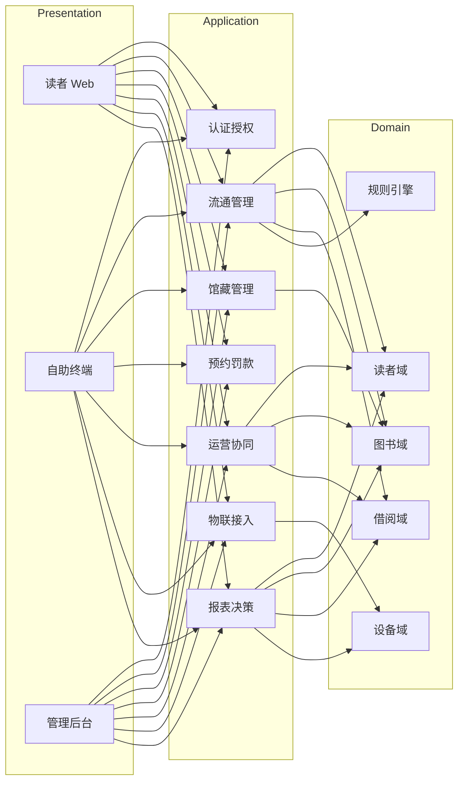
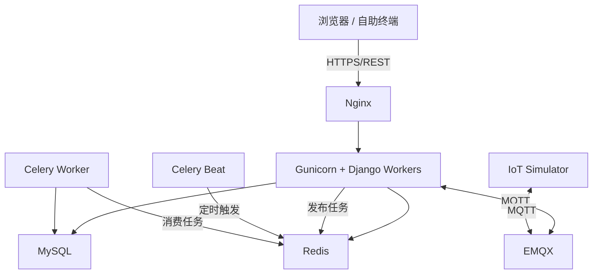
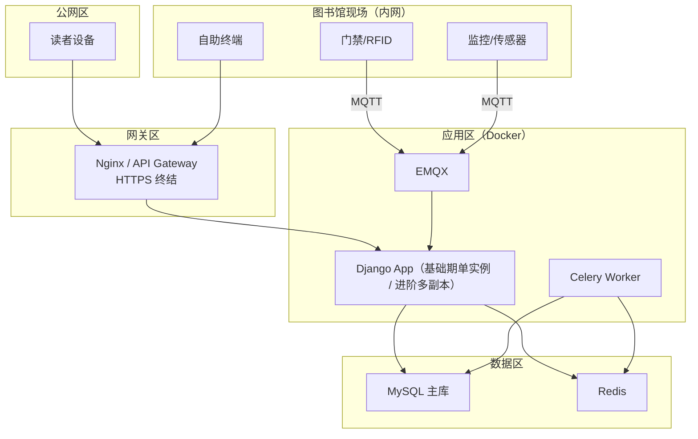
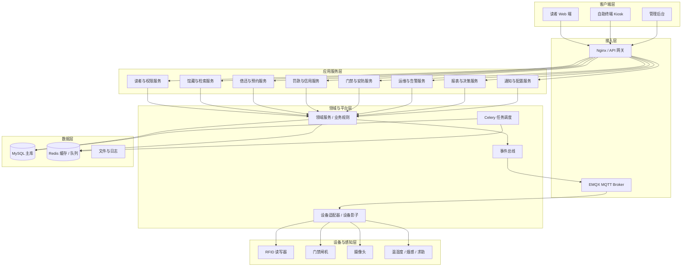
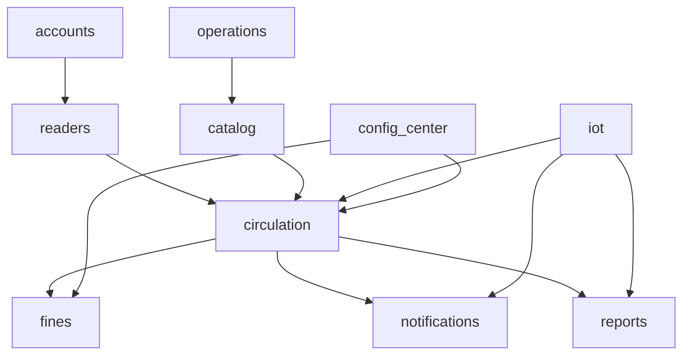
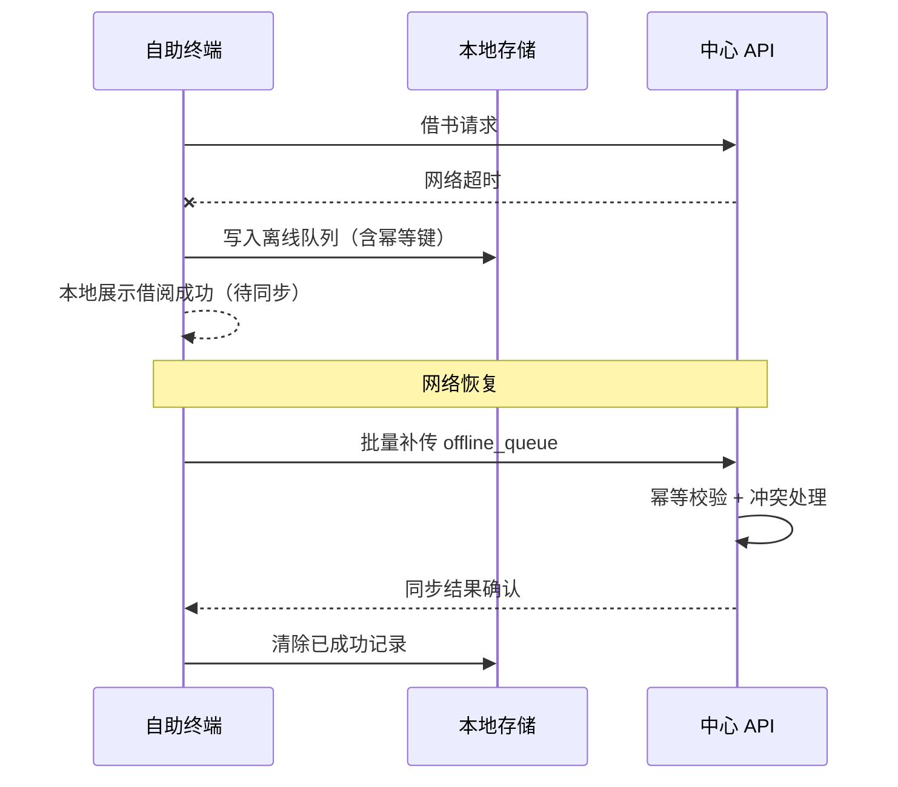
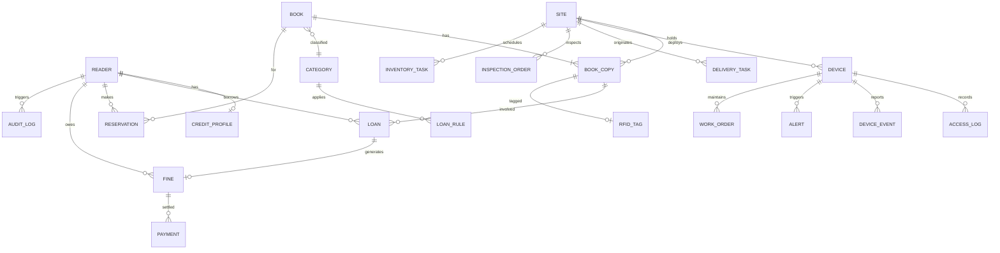
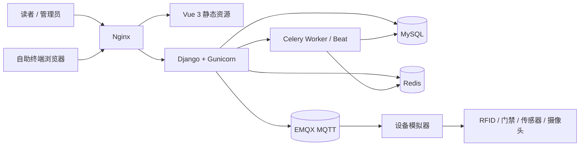

# 无人值守图书馆系统 — 架构设计文档（融合版 V2.1）

| 项目名称 | 无人值守图书馆系统（管理系统 + 运营支撑） |
| --- | --- |
| 文档版本 | V2.1（一致性修订版） |
| 编写日期 | 2026-09-20 |
| 文档状态 | 评审中（待架构评审会确认） |
| 编制依据 | 《无人值守图书馆系统 — 需求文档（融合版）》V2.0 |
| 优先级说明 | **基础**：一期必须完成，架构必须支撑；**进阶**：二期或条件具备，架构预留扩展。**P0/P1/P2** 为实施排期映射：**P0、P1 属基础层（一期）**，**P2 属进阶层（二期）** |

---

## 1 引言

### 1.1 编写目的

本文档依据《无人值守图书馆系统 — 需求文档（融合版）》V2.0，给出系统的架构样式、参考模型、参考架构、质量场景、技术框架、设计模式、数据与部署架构，并明确基础层与进阶层优先级。本文档用于指导后续详细设计、开发、测试、部署与验收，同时作为架构评审、立项申报和课设/毕设实施的依据。

### 1.2 架构范围

覆盖需求文档中的 FR-01 至 FR-57、NFR-01 至 NFR-10，包括：

- 读者与权限、馆藏、借还、预约、罚款、信用
- 门禁、安防、环境、设备、远程运维、离线降级
- 馆藏调配、物流配送、消毒上架、巡检维修、运营考核
- 报表决策、系统集成、空间布点支撑、安全与隐私合规
- 基础层与进阶层功能的分期演进

不在本期范围：图书采编全自助化、财务总账、用户社交社区、真实支付生产接入、真实硬件大规模部署。

### 1.3 读者对象

- 架构师、开发人员、测试人员
- 项目评审与立项申报人员
- 图书馆运营方、设备与运维人员
- 馆方管理者与安全合规人员
- 课设/毕设指导教师与评审老师

### 1.4 术语与优先级

| 术语 | 说明 |
| --- | --- |
| 架构样式 | 系统整体组织方式，如分层、事件驱动、模块化单体 |
| 参考模型 | 用于划分层次与能力的通用模型，如 IoT 四层模型、ISO/IEC 25010、4+1 视图 |
| 参考架构 | 可落地的总体结构、模块划分与接口关系 |
| 质量场景 | 对性能、可用性、安全性等质量属性的可度量描述 |
| 基础 | 一期必须完成，是“能开门、能借还、保安全、可运维、可合规”的底线 |
| 进阶 | 二期或条件具备，用于提升服务品质与运营效率 |
| P0/P1/P2 | 实施排期：P0 核心闭环，P1 运营增强，P2 进阶扩展。P0、P1 属基础层（一期），P2 属进阶层（二期） |

---

## 2 架构目标与约束

### 2.1 架构目标

| 编号 | 目标 | 优先级 |
| --- | --- | --- |
| AG-01 | 支撑 7×24 小时无人值守自助服务 | 基础 |
| AG-02 | 支撑自助借还、预约、续借、罚款、信用等核心业务 | 基础 |
| AG-03 | 通过 RFID、门禁、安防、环境设备实现无人场景保障 | 基础 |
| AG-04 | 支持馆藏调配、物流配送、消毒上架、巡检维修等运营闭环 | 基础 |
| AG-05 | 支持远程优先、现场兜底的运维模式 | 基础 |
| AG-06 | 满足个人信息保护、数据安全、审计与合规要求 | 基础 |
| AG-07 | 支持自动分拣、环境联动、阅读活动、城市平台等扩展 | 进阶 |
| AG-08 | 支持多馆协同、座位预约、推荐、可视化大屏等未来扩展 | 进阶 |

### 2.2 关键约束

| 约束 | 说明 | 优先级 |
| --- | --- | --- |
| 技术栈 | Django + Vue 3 + Element Plus + Vite + MySQL + Redis + MQTT（EMQX） | 基础 |
| 客户端 | B/S 架构，响应式 Web；无独立 App / 小程序 | 基础 |
| 部署 | 内网 + 公网网关，支持 Docker 容器化 | 基础 |
| 硬件 | RFID、门禁、摄像头、传感器以模拟 / 仿真为主 | 基础 |
| 支付 | 第三方支付沙箱 / 模拟支付 | 基础 |
| 规则 | 借阅上限、借期、续借次数、罚款费率等参数化 | 基础 |
| 合规 | 生物识别单独同意、最小必要、访问留痕、超期删除 | 基础 |
| 成本 | 全天候运行成本刚性，设备选型控制单位造价 | 基础 |

### 2.3 设计原则

1. **业务闭环优先**：先实现“能开门、能借还、保安全、可运维、可合规”。
2. **分层解耦**：客户端层、接入层、应用服务层、领域与平台层、数据层、设备与感知层职责清晰（层次定义见 §5.2）。
3. **质量驱动**：以性能、可用性、安全性、可维护性场景指导技术选型。
4. **可演进**：基础层稳定交付，进阶层通过标准接口与模块插件扩展。
5. **仿真可演示**：硬件以 MQTT 模拟接入，保证课设可运行、可验收。

### 2.4 需求—架构关注点映射

| 需求域 | 架构关注点 | 架构响应 | 优先级 |
| --- | --- | --- | --- |
| FR-01~06 读者权限 | 身份、认证、授权、审计 | JWT + RBAC + 审计日志 | 基础 |
| FR-07~15 馆藏与 RFID | 数据一致性、设备接入、盘点 | Repository + Adapter + MQTT | 基础 |
| FR-16~20 自助借还 | 事务、幂等、离线 | 数据库事务 + 幂等键 + 本地缓存 | 基础 |
| FR-21~26 预约罚款信用 | 规则可配置、定时任务 | Strategy + Celery | 基础 |
| FR-27~34 无人值守保障 | 实时、告警、远程、降级 | 事件驱动 + MQTT + 设备影子 | 基础 |
| FR-35~39 运营协同 | 工单、配送、考核、活动 | 工作流 + 报表 + 活动模块 | 基础/进阶 |
| FR-40~51 后台与集成 | 管理、报表、接口、扩展 | Django Admin + REST + 标准接口 | 基础/进阶 |
| FR-52~57 空间与合规 | 布点、开放、安全、隐私 | 配置化 + 安全架构 + 审计 | 基础 |
| NFR-01~10 质量属性 | 性能、可用、安全、可靠、扩展 | 质量场景 + 部署架构 + 设计模式 | 基础/进阶 |

---

## 3 架构样式

系统采用 **以模块化单体为基础、分层与事件驱动结合、端口适配器隔离硬件、前后端分离** 的混合架构样式。基础期不引入微服务，避免过早分布式复杂度；进阶层按设备接入、报表、通知等边界逐步拆分。

### 3.1 分层架构

- 客户端层：读者 Web、自助终端、管理后台。
- 接入层：Nginx、API 网关、MQTT Broker。
- 应用服务层：读者、馆藏、借还、预约、罚款、门禁、安防、运维、报表。
- 领域与平台层：业务规则、状态机、策略、领域事件、设备适配、任务调度。
- 数据层：MySQL、Redis、文件与日志。
- 设备与感知层：RFID、门禁、摄像头、传感器、烟感。

> 层次命名以 §5.2「层次职责」表为准，全文统一使用上述六层名称。

### 3.2 前后端分离 / B/S

- Vue SPA + Django REST API。
- 读者端、自助终端、管理后台均为 Web 浏览器访问。
- 自助终端运行 Chromium Kiosk 模式，启用大字体、简化流程。
- 服务端集中处理业务逻辑与数据一致性。

### 3.3 模块化单体

基础期以后端单体 + 模块边界方式实现。模块之间通过服务接口与领域事件交互，禁止跨模块直接写表。进阶层可将设备接入、报表、通知等模块独立部署。

### 3.4 事件驱动

设备遥测、告警、借还完成、预约到馆、逾期提醒等以事件方式发布。

- **基础期**：设备侧事件经 **MQTT（EMQX）** 接入，主题规范见 §5.5；业务领域事件（借还完成、预约到馆、逾期提醒）用 Redis Pub/Sub 或 Django 信号 + Celery 承载。
- **进阶层**：引入独立消息队列承载高吞吐事件，并按边界拆分事件消费者。

### 3.5 端口适配器 / 六边形

核心业务不直接依赖具体硬件协议。RFID、门禁、摄像头、传感器通过适配器接入，模拟设备与真实设备可替换。支付、实名认证、城市平台同样以适配器方式隔离。

### 3.6 管道—过滤器

借还书流程采用责任链式处理管道：

```text
身份识别 → 资格校验 → 库存锁定 → 规则引擎 → 事务提交 → 事件发布 → 通知推送
```

任一环节失败则短路返回，保证业务规则可组合、可测试。

### 3.7 边缘—云协同

自助终端本地缓存，中心平台统一管理。断网时终端可完成借还并写入离线队列，恢复后补传，保证最终一致。

### 3.8 架构样式汇总

| 架构样式 | 说明 | 应用位置 | 优先级 |
| --- | --- | --- | --- |
| 分层架构 | 客户端层、接入层、应用服务层、领域与平台层、数据层、设备与感知层分离 | 整体系统 | 基础 |
| 前后端分离 | Vue SPA + Django REST API | 读者端、自助终端、管理后台 | 基础 |
| 模块化单体 | 按业务域划分模块，单进程部署 | 后端主体 | 基础 |
| 事件驱动 | 设备事件、告警、通知、数据回流 | 安防、运维、报表 | 基础 |
| 端口适配器 / 六边形 | 核心业务与硬件、支付、外部系统解耦 | RFID、门禁、传感器、支付 | 基础 |
| 管道—过滤器 | 借还处理链、责任链校验 | 流通借还 | 基础 |
| 边缘—云协同 | 自助终端本地缓存，中心平台统一管理 | 离线降级、远程运维 | 基础 |
| 微服务化 | 按设备接入、报表、通知等拆分 | 进阶层备选 | 进阶 |
| CQRS / 读写分离 | 报表查询与交易写入分离 | 数据决策、大屏 | 进阶 |

### 3.9 架构关键决策摘要

| 决策项 | 选择 | 理由 |
| --- | --- | --- |
| 总体风格 | 分层架构 + 前后端分离 + 模块化单体 | 符合 B/S 约束，团队分工清晰，便于演示与验收 |
| 物联接入 | MQTT + 设备适配器 + 设备影子 | 解耦硬件协议，模拟与真实设备可替换 |
| 数据存储 | MySQL + Redis | 事务一致性 + 缓存/会话/队列 |
| 异步任务 | Celery + Beat | 逾期计算、消息推送、报表生成 |
| 鉴权方式 | JWT + RBAC | 无状态、适合多端与水平扩展 |
| 部署方式 | Docker 容器化 | 内网/公网网关统一部署 |

---

## 4 参考模型

### 4.1 IoT 四层参考模型

| 层次 | 内容 | 对应需求 | 优先级 |
| --- | --- | --- | --- |
| 感知层 | RFID、门禁、摄像头、温湿度、烟感 | FR-14、FR-27、FR-30、FR-31 | 基础 |
| 网络层 | MQTT、HTTP、内网 / 公网网关 | FR-33、FR-34、NFR-05 | 基础 |
| 平台层 | 设备管理、事件、数据、告警、任务 | FR-29、FR-31、FR-43、FR-47 | 基础 |
| 应用层 | 读者服务、馆藏、借还、运维、报表 | FR-01~57 | 基础/进阶 |

### 4.2 业务能力参考模型

| 能力域 | 子能力 | 优先级 |
| --- | --- | --- |
| 读者服务 | 注册、登录、实名、信用、借阅历史 | 基础 |
| 馆藏运营 | 入库、检索、分类、调配、配送、消毒 | 基础 |
| 流通服务 | 借书、还书、续借、预约、取书、罚款 | 基础 |
| 无人值守保障 | 门禁、安防、环境、告警、远程、离线 | 基础 |
| 运营管理 | 工单、巡检、考核、成本、活动 | 基础/进阶 |
| 数据决策 | 报表、选址、配书、开放时段优化 | 基础 |
| 集成扩展 | 馆内系统、城市平台、信用借还 | 基础/进阶 |
| 安全合规 | 权限、审计、隐私、支付安全、应急 | 基础 |

### 4.3 质量参考模型

采用 ISO/IEC 25010 质量属性分类，结合无人值守场景重点：

- 功能性：借还、预约、罚款、门禁、盘点、告警。
- 性能效率：≤500ms、≥500 并发、检索≤2s。
- 兼容性：多端浏览器、自助终端、设备协议。
- 易用性：3 步完成核心操作、大字体、无障碍。
- 可靠性：离线降级、事务一致、备份恢复；可用性指标见 QS-04（99.9% 为设计目标，基础期以可达场景为验收依据）。
- 安全性：认证、授权、加密、审计、隐私、支付安全。
- 可维护性：模块化、日志、告警、远程运维。
- 可移植性：Docker、标准接口、模拟 / 真实设备替换。

### 4.4 4+1 视图模型

采用 Kruchten 4+1 视图描述系统架构，与 IoT 四层、业务能力模型互补。

#### 4.4.1 逻辑视图



核心领域实体：

| 领域 | 核心实体 | 关键关系 |
| --- | --- | --- |
| 读者域 | Reader, CreditProfile, AuthCredential | 1 读者 : 1 信用档案 |
| 图书域 | Book, BookCopy, Category, RfidTag, LoanRule | 1 书目 : N 馆藏副本 |
| 借阅域 | Loan, Reservation, Fine, Payment | 1 副本 : 0..1 当前借阅 |
| 设备域 | Device, DeviceEvent, AccessLog, Alert | 1 设备 : N 事件日志 |
| 运营域 | WorkOrder, DeliveryTask, InspectionOrder, InventoryTask, Site | 1 网点 : N 配送/巡检/盘点任务 |
| 平台域 | AuditLog, SystemConfig | 全局配置与审计，不参与业务关系 |

实体命名与完整清单以 **§9.2 为准**，本表与其保持一致。

#### 4.4.2 开发视图

```text
library-system/
├── backend/                    # Django 后端
│   ├── config/                 # 项目配置、URL、中间件
│   ├── apps/
│   │   ├── accounts/           # 认证、RBAC、审计
│   │   ├── readers/            # 读者、信用、实名
│   │   ├── catalog/            # 书目、分类、检索
│   │   ├── circulation/        # 借还、续借、预约
│   │   ├── fines/              # 逾期、罚款、支付沙箱
│   │   ├── iot/                # MQTT 接入、设备管理、告警
│   │   ├── operations/         # 配送、巡检、考核
│   │   ├── reports/            # 报表、统计
│   │   ├── notifications/      # 站内信、短信（模拟）
│   │   └── config_center/      # 借阅规则、开放时间参数化
│   ├── domain/                 # 领域服务、规则引擎、事件
│   └── tests/
├── frontend/                   # Vue 3 前端
│   ├── reader-portal/          # 读者 Web
│   ├── kiosk/                  # 自助终端（大字体/简化流程）
│   └── admin-portal/           # 管理后台扩展页
├── iot-simulator/              # MQTT 设备模拟器（RFID/门禁/传感器）
├── deploy/                     # Docker Compose、Nginx 配置
└── docs/                       # 需求、架构、评审文档
```

模块依赖规则：

- `apps/*` 可依赖 `domain/`，不可跨 App 直接 import 模型，通过 Service 接口调用。
- `iot/` 仅通过领域事件影响 `circulation/`，不直接修改数据库。
- `frontend/` 仅通过 REST API 与后端通信。

#### 4.4.3 进程视图



关键运行时行为：

| 进程 | 职责 | 关联需求 |
| --- | --- | --- |
| Gunicorn Worker | 同步 API 请求、借还事务 | NFR-01 性能 |
| Celery Beat + Worker | 逾期计算、预约超时、报表 | FR-24 |
| Redis | JWT 黑名单、热点缓存、分布式锁 | NFR-01、NFR-04 |
| EMQX | 设备消息路由 | FR-14、FR-27、FR-31 |
| IoT Simulator | 模拟 RFID/门禁/传感器 | 技术约束、课设演示 |

#### 4.4.4 物理视图



#### 4.4.5 场景视图

场景视图通过典型用例验证其他四视图，详见第 6 章质量场景、第 8 章设计模式中的借还书与离线补传时序。

---

## 5 参考架构

### 5.1 总体参考架构图



### 5.2 层次职责

| 层次 | 职责 | 优先级 |
| --- | --- | --- |
| 客户端层 | 读者自助、终端交互、后台管理 | 基础 |
| 接入层 | 路由、鉴权、限流、MQTT 接入 | 基础 |
| 应用服务层 | 业务用例编排、权限校验、事务边界 | 基础 |
| 领域与平台层 | 业务规则、状态、事件、设备适配、任务 | 基础 |
| 数据层 | 持久化、缓存、队列、文件、日志 | 基础 |
| 设备与感知层 | 采集、识别、控制、告警 | 基础 |

### 5.3 后端参考架构：Django 分层 + DRF

```text
HTTP Request
    ↓
Middleware（CORS / JWT / 限流 / 审计）
    ↓
View / ViewSet（参数校验、权限检查）
    ↓
Application Service（用例编排、事务）
    ↓
Domain Service（规则引擎、状态机）
    ↓
Repository（ORM 数据访问）
    ↓
MySQL / Redis / MQTT
```

| 组件 | 框架/库 | 用途 |
| --- | --- | --- |
| Web 框架 | Django 5.x | MTV、Admin、ORM |
| API | Django REST Framework | RESTful API、序列化、权限 |
| 鉴权 | djangorestframework-simplejwt | JWT 签发与刷新 |
| 任务队列 | Celery + Redis | 定时任务、异步通知 |
| 物联 | paho-mqtt / asyncio-mqtt | MQTT 订阅发布 |
| 缓存 | django-redis | 热点数据、分布式锁 |

### 5.4 前端参考架构：Vue 3 SPA

```text
main.ts
  ↓
Router（reader / kiosk / admin 路由）
  ↓
Pinia Store（用户态、借阅态）
  ↓
Views + Element Plus 组件
  ↓
Axios API Client（JWT 拦截器）
  ↓
Django REST API
```

- 读者 Web：完整功能（检索、预约、续借、历史）。
- 自助终端 Kiosk：简化借还流程，3 步内完成；支持离线缓存队列。
- 管理后台：Django Admin 快速实现 CRUD + Vue 扩展报表与大屏。

### 5.5 物联参考架构：MQTT 主题规范

| 主题 | 方向 | 说明 | 优先级 |
| --- | --- | --- | --- |
| `library/{siteId}/device/{deviceId}/telemetry` | 设备→平台 | 温湿度、状态 | 基础 |
| `library/{siteId}/device/{deviceId}/event` | 设备→平台 | 门禁、告警、盘点 | 基础 |
| `library/{siteId}/device/{deviceId}/command` | 平台→设备 | 开门、重启、盘点 | 基础 |
| `library/{siteId}/device/{deviceId}/status` | 设备→平台 | 在线、离线、故障 | 基础 |
| `library/{siteId}/rfid/{deviceId}/scan` | 设备→云 | RFID 标签批量上报 | 基础 |
| `library/{siteId}/door/{deviceId}/access` | 设备→云 | 门禁通行事件 | 基础 |
| `library/{siteId}/door/{deviceId}/cmd` | 云→设备 | 开门/锁门指令 | 基础 |
| `library/{siteId}/sensor/{deviceId}/data` | 设备→云 | 温湿度遥测 | 基础 |
| `library/{siteId}/alert/{deviceId}` | 设备→云 | 烟感/求助/防盗告警 | 基础 |

设备适配器模式：每种设备类型实现统一 `DeviceAdapter` 接口，解析 MQTT 载荷为领域事件，便于模拟器与真实硬件切换。

> 本节是 MQTT 主题规范的**唯一权威定义**；§10.4 引用本节，不再重复罗列，避免两处维护产生偏差。

### 5.6 模块划分与优先级

| 模块 | Django App | 主要职责 | 对应需求 | 优先级 |
| --- | --- | --- | --- | --- |
| 认证授权 | `accounts` | 注册登录、JWT、RBAC、审计 | FR-01~06 | P0 |
| 读者管理 | `readers` | 实名认证、信用等级、读者信息 | FR-01~06 | P0 |
| 馆藏管理 | `catalog` | 入库、维护、检索、分类、统计 | FR-07~11 | P0 |
| 馆藏调配与物流 | `operations` | 调配、配送、验收、上架、消毒 | FR-12、FR-13、FR-35 | P1 |
| RFID 与盘点 | `iot` / `catalog` | 定位、盘点、错架、防盗 | FR-14、FR-15 | P0/进阶 |
| 流通借还 | `circulation` | 借书、还书、续借、预约、取书 | FR-16~23 | P0 |
| 罚款支付 | `fines` | 逾期、罚款、信用、支付 | FR-24~26 | P1 |
| 物联接入 | `iot` | MQTT、设备管理、门禁、安防、告警 | FR-27~34、FR-43 | P0 |
| 环境与设备 | `iot` | 温湿度、照明、空调、设备状态 | FR-29、FR-43 | P2 |
| 运维与工单 | `operations` / `iot` | 巡检、维修、远程、离线补传 | FR-33、FR-34、FR-36 | P0/P1 |
| 运营协同 | `operations` | 考核、成本、人力、阅读活动 | FR-37~39 | P1/P2 |
| 消息通知 | `notifications` | 站内信、短信模拟、公告 | FR-22、FR-24 | P1 |
| 报表决策 | `reports` | 报表、统计、大屏数据 | FR-47~49 | P1/P2 |
| 系统配置 | `config_center` | 借阅规则、开放时间参数化 | FR-46、FR-52 | P0 |

### 5.7 模块依赖关系



依赖原则：

- 图中箭头表示**数据与事件流向**（提供方 → 消费方），**不是 import 方向**；模块间调用一律通过 Service 接口或领域事件完成。
- `circulation` 是核心，其他模块向其提供数据或消费其事件。
- 禁止跨 App 直接 import 模型、禁止跨模块直接写表（与 §4.4.2 开发视图规则一致）。
- `iot` 仅通过领域事件影响 `circulation`，不直接修改其数据表；禁止 `catalog` 直接依赖 `iot`。

### 5.8 基础层与进阶层演进

| 阶段 | 架构形态 | 内容 |
| --- | --- | --- |
| 基础期 | 模块化单体 + 分层 + MQTT 适配器 | 核心业务、门禁安防、运维告警、后台报表、安全合规 |
| 进阶层 | 模块拆分 + 事件驱动增强 + 读写分离 | 自动分拣、环境联动、活动、城市平台、信用扩展、大屏 |

---

## 6 质量场景

| 编号 | 质量属性 | 场景 | 刺激源 | 响应 | 度量 | 架构策略 | 优先级 |
| --- | --- | --- | --- | --- | --- | --- | --- |
| QS-01 | 性能 | 借还高峰期，500 并发读者操作 | 读者 | 接口正常响应，事务不丢失 | 95% 请求 ≤500ms | 无状态 API、Redis 缓存、连接池、索引优化 | 基础 |
| QS-02 | 性能 | 10 万条馆藏记录检索 | 读者/管理员 | 返回检索结果 | ≤2s | 全文索引、缓存热门检索 | 基础 |
| QS-03 | 性能 | RFID 批量扫描 20 本图书 | 自助终端 | 完成识别并更新库存 | 单次还书 ≤3s | MQTT 异步上报 + 批量事务 | 基础 |
| QS-04 | 可用性 | 7×24 运行期间服务进程异常退出或中断 | 系统 | 健康检查发现，自动重启并恢复服务；数据每日备份可恢复 | 基础期（可达）：5 分钟内恢复服务、备份可恢复；设计目标：可用性 99.9%（由进阶层多节点部署支撑，见 §11.4） | 多 Worker、健康检查、Docker 重启、每日备份 | 基础 |
| QS-05 | 可用性 | 自助终端断网 | 网络故障 | 本地缓存交易，恢复后补传 | 交易最终一致 | 离线队列 + 幂等补传 | 基础 |
| QS-06 | 可用性 | MQTT Broker 短暂不可用 | 设备在线 | 设备本地缓冲、恢复后重传 | 事件不丢失 | QoS 1、设备端重试、幂等消费 | 基础 |
| QS-07 | 可靠性 | 借还过程中库存与借阅记录更新 | 读者 | 原子事务，不出现半更新 | 数据一致率 100% | 数据库事务、行锁/乐观锁 | 基础 |
| QS-08 | 可靠性 | 还书事务提交后进程崩溃 | 异常退出 | 库存与借阅记录一致 | 事务 ACID | Django atomic 事务 | 基础 |
| QS-09 | 安全性 | 人脸信息采集 | 读者 | 单独告知、同意、加密、留痕 | 合规可审计 | 单独同意、字段加密、审计日志 | 基础 |
| QS-10 | 安全性 | 在线支付罚款 | 读者 | 签名校验、防重放、幂等 | 无重复扣款 | 签名、防重放、幂等键、对账 | 基础 |
| QS-11 | 安全性 | 未借图书离馆 | 读者 | 门禁联动报警 | 报警及时率 ≥99% | RFID + 门禁联动 + 事件驱动 | 基础 |
| QS-12 | 可维护性 | 新增 RFID 设备型号 | 运维 | 适配器接入，不改核心 | 接入周期可评估 | 设备适配器 + 工厂注册 | 基础 |
| QS-13 | 可维护性 | 调整借阅规则 | 运营 | 管理员配置生效 | 无需发版 | 规则引擎 + 参数化配置 | 基础 |
| QS-14 | 可扩展性 | 向城市平台汇聚数据 | 系统 | 标准 API / 消息推送 | 接口兼容 | 集成 Adapter、标准 API | 进阶 |
| QS-15 | 易用性 | 读者自助借书 | 读者 | 3 步内完成 | 操作成功率 ≥95% | Kiosk 专用 UI、引导式流程 | 基础 |
| QS-16 | 成本 | 夜间无人在馆 | 系统 | 自动节能，部分空间开放 | 能耗可统计 | 分时开放、设备节能策略 | 进阶 |
| QS-17 | 运维 | 设备离线 | 设备 | 自动告警，远程优先，现场兜底 | 5 分钟内告警 | 设备影子、告警、工单 | 基础 |
| QS-18 | 合规 | 审计检查 | 管理员 | 关键操作留痕，可追溯 | 日志完整率 100% | 审计日志不可篡改、访问留痕 | 基础 |

---

## 7 框架与技术选型

| 层次 / 用途 | 技术 | 说明 | 优先级 |
| --- | --- | --- | --- |
| 后端框架 | Django + Django REST Framework | 业务、API、Admin | 基础 |
| 前端框架 | Vue 3 + Element Plus + Vite | 读者端、管理端、终端界面 | 基础 |
| 前端状态与路由 | Pinia + Vue Router | SPA 状态与路由 | 基础 |
| HTTP 客户端 | Axios | 前后端通信 | 基础 |
| 数据库 | MySQL | 主数据、交易、报表 | 基础 |
| 缓存 / 队列 | Redis | 缓存、会话、队列、Pub/Sub | 基础 |
| 消息通信 | MQTT（EMQX） | 设备遥测、命令、事件 | 基础 |
| 任务调度 | Celery + Beat | 逾期计算、盘点、报表、通知 | 基础 |
| 认证授权 | JWT + RBAC | 登录、权限、审计 | 基础 |
| 部署 | Docker + Nginx + Gunicorn | 容器化、反向代理、WSGI | 基础 |
| 测试 | pytest + Vitest | 单元与接口测试 | 基础 |
| 监控 | Prometheus + Grafana | 设备、接口、资源监控 | 进阶 |
| 日志 | Loki / ELK | 集中日志与检索 | 进阶 |
| 大屏 | ECharts / DataV | 在馆人数、报表可视化 | 进阶 |

---

## 8 设计模式

| 设计模式 | 应用位置 | 解决的问题 | 优先级 |
| --- | --- | --- | --- |
| 分层模式 | 整体架构 | 关注点分离 | 基础 |
| MVC / MVT | Django 应用 | 请求处理与模板 / API | 基础 |
| Repository | 数据访问 | 隔离 ORM 与业务 | 基础 |
| Service Layer | 应用服务 | 用例编排、事务边界 | 基础 |
| Adapter | RFID、门禁、支付、城市平台 | 隔离外部协议 | 基础 |
| Facade | 设备接入、借还流程 | 简化复杂子系统 | 基础 |
| Strategy | 借阅规则、罚款计算、认证方式 | 规则可配置 | 基础 |
| State | 图书状态、设备状态、工单状态 | 状态流转清晰 | 基础 |
| Observer / Pub-Sub | 告警、通知、事件 | 解耦事件生产者与消费者 | 基础 |
| Factory | 设备适配器、支付渠道 | 创建可替换实现 | 基础 |
| Device Shadow | 设备在线状态与期望状态 | 离线设备管理 | 基础 |
| Retry + Idempotency | 支付、借还、设备命令 | 防重复、防丢失 | 基础 |
| 责任链 | 借书资格校验链 | 校验步骤可组合、可测试 | 基础 |
| 装饰器 | 审计日志、权限、限流 | 横切关注点分离 | 基础 |
| 单例 | MQTT 连接管理 | 连接复用 | 基础 |
| Circuit Breaker | 外部接口、设备网关 | 防止故障扩散 | 进阶 |
| CQRS | 报表与大屏 | 读写分离 | 进阶 |
| API Gateway | Nginx / 网关 | 路由、鉴权、限流 | 基础 |
| BFF | 终端专用接口 | 多端适配 | 进阶 |

### 8.1 借还书核心流程时序

```mermaid
sequenceDiagram
    participant R as 读者/终端
    participant API as REST API
    participant S as CirculationService
    participant RE as RuleEngine
    participant DB as MySQL
    participant MQ as MQTT/EMQX
    participant N as 通知服务

    R->>API: POST /api/v1/circulation/borrow (book_ids, token)
    API->>S: borrow(reader, books)
    S->>RE: validate(reader, books)
    RE-->>S: pass / reject
    alt 校验失败
        S-->>API: 业务错误（HTTP 200 + code≠0，见 §10.3）
        API-->>R: 提示原因
    else 校验通过
        S->>DB: BEGIN; 锁定副本; 创建 Loan; 更新库存; COMMIT
        S->>MQ: 发布 borrow.event
        S->>N: 发送借阅成功通知
        S-->>API: 200 + 借阅详情
        API-->>R: 显示应还日期
    end
```

### 8.2 离线降级与补传时序



---

## 9 数据架构

### 9.1 数据分类

| 数据类别 | 示例 | 存储 | 优先级 |
| --- | --- | --- | --- |
| 主数据 | 读者、图书、馆藏、设备 | MySQL | 基础 |
| 交易数据 | 借阅、归还、预约、罚款、支付 | MySQL | 基础 |
| 行为数据 | 进出馆、在馆人数、检索 | MySQL + Redis | 基础 |
| 设备数据 | 遥测、状态、告警 | MQTT + MySQL + Redis | 基础 |
| 日志审计 | 操作日志、安全日志 | MySQL / 文件 / 日志系统 | 基础 |
| 隐私数据 | 人脸、身份证、手机号 | 加密存储，分级访问 | 基础 |
| 报表数据 | 借还趋势、热门图书、设备利用率 | MySQL 汇总 / 缓存 | 基础/进阶 |

### 9.2 核心实体

| 域 | 实体（领域模型类名 ↔ 数据库表名） |
| --- | --- |
| 读者域 | `Reader` ↔ `reader`、`CreditProfile` ↔ `credit_profile`、`AuthCredential` |
| 图书域 | `Book` ↔ `book`、`BookCopy` ↔ `book_copy`、`Category`、`RfidTag`、`LoanRule` |
| 借阅域 | `Loan`、`Reservation`、`Fine`、`Payment` |
| 设备域 | `Device`、`DeviceEvent`、`AccessLog`、`Alert` |
| 运营域 | `WorkOrder`、`DeliveryTask`、`InspectionOrder`、`InventoryTask`、`Site` |
| 平台域 | `AuditLog`、`SystemConfig` |

实体命名约定：领域模型类名用 **CamelCase**（Python 风格），数据库表名与 ER 图用 **snake_case / UPPER_SNAKE_CASE**（如 `BookCopy` ↔ `book_copy` ↔ `BOOK_COPY`）。**本节为实体命名的权威定义，§4.4.1 与 §9.3 均与本表对齐。**

### 9.3 数据库设计概要



`SystemConfig` 为全局配置表，不参与上述关系。

实体命名与完整清单以 §9.2 为准（本图为**核心关系子集**，已覆盖 §9.2 全部实体）。

关键索引：`book_copy.status`、`loan.reader_id + return_date`、`book.isbn`、`access_log.site_id + time`。

### 9.4 数据流

1. 读者 / 终端 → API → 业务服务 → MySQL / Redis。
2. 设备 → MQTT → 设备适配器 → 事件总线 → 告警 / 报表 / 工单。
3. 定时任务 → 逾期计算、盘点、报表、通知。
4. 报表服务 → 管理后台 / 大屏 / 城市平台。

### 9.5 一致性与缓存

- 借还、预约、罚款使用数据库事务。
- 支付、设备命令使用幂等键。
- Redis 缓存热点数据，缓存失效不影响交易。
- 离线交易本地缓存，恢复后补传，保证最终一致。
- 离线补传与在线记录冲突时，以服务端为准合并。

### 9.6 隐私合规

- 生物识别单独告知、单独同意。
- 敏感字段加密存储、传输。
- 数据分级、访问留痕、超期删除。
- 审计日志不可篡改。

---

## 10 集成与接口架构

### 10.1 API 架构

- 风格：REST / JSON。
- 版本：`/api/v1/`（全局统一前缀，全部分组见 §10.2）。
- 认证：JWT。
- 授权：RBAC。
- 幂等：支付、借还、设备命令使用幂等键。
- 限流：登录、查询、支付接口限流。

### 10.2 REST API 分组

| 分组 | 前缀 | 示例 |
| --- | --- | --- |
| 认证 | `/api/v1/auth/` | `POST /login`, `POST /refresh` |
| 读者 | `/api/v1/readers/` | `GET /me`, `PUT /profile` |
| 馆藏 | `/api/v1/books/` | `GET /search?q=`, `GET /{id}` |
| 流通 | `/api/v1/circulation/` | `POST /borrow`, `POST /return` |
| 预约 | `/api/v1/reservations/` | `POST /`, `GET /my` |
| 罚款 | `/api/v1/fines/` | `GET /my`, `POST /pay` |
| 物联 | `/api/v1/iot/` | `GET /devices`, `POST /door/open` |
| 报表 | `/api/v1/reports/` | `GET /dashboard` |

### 10.3 统一响应格式

```json
{
  "code": 0,
  "message": "ok",
  "data": {},
  "request_id": "uuid"
}
```

业务错误 `code != 0`。两类错误分开处理：

- **业务规则类错误**（库存不足、超借阅上限、信用不足等）统一返回 **HTTP 200 + 业务码**（如 `code=4001`），便于前端统一处理；
- **协议与鉴权类错误**（未登录 401、无权限 403、参数格式错误 400）仍使用对应 HTTP 状态码。

§8.1 时序图中的「业务错误」按本规则返回；幂等重放返回首次结果，不重复报错。

### 10.4 MQTT 主题

MQTT 主题规范的**唯一权威定义见 §5.5**。本节不再重复罗列主题表，以免两处维护产生偏差；设备接入、模拟器实现与联调一律以 §5.5 为准。

### 10.5 外部集成

| 集成对象 | 方式 | 优先级 |
| --- | --- | --- |
| 馆内业务系统 | REST / 数据库视图 / 中间表 | 基础 |
| 实名认证 | 第三方 API 适配器 | 基础 |
| 支付 | 沙箱 / 模拟支付 | 基础 |
| 城市侧平台 | REST / 消息推送 | 进阶 |
| 信用借还 | 标准接口 | 进阶 |

### 10.6 接口安全

- HTTPS / TLS。
- 签名校验、防重放。
- 接口频率限制。
- 防 SQL 注入与 XSS。
- 关键接口审计。

---

## 11 部署架构

### 11.1 基础部署



- **基础期为单节点 Docker Compose 部署**：无备节点，**不提供主备切换**；可用性以 QS-04 的基础期场景为准（健康检查 + 自动重启，5 分钟内恢复服务 + 每日备份可恢复）。主备切换属进阶层目标，方案见 §11.4。
- `celery-beat` 为单实例（定时任务不可多实例并发触发），属已知单点，进阶方案见 §11.4。
- Nginx 反向代理，前端静态资源与 API 分离。
- MySQL 每日备份，Redis 持久化。
- EMQX 承载设备模拟与真实设备接入。

### 11.2 Docker Compose 服务清单

| 服务 | 镜像/构建 | 端口 | 说明 |
| --- | --- | --- | --- |
| nginx | nginx:alpine | 80/443 | 反向代理 |
| web | backend/Dockerfile | 8000 | Django + Gunicorn |
| celery-worker | backend/Dockerfile | — | 异步任务 |
| celery-beat | backend/Dockerfile | — | 定时调度 |
| mysql | mysql:8 | 3306 | 主库 |
| redis | redis:7-alpine | 6379 | 缓存/队列 |
| emqx | emqx:5 | 1883/8083 | MQTT |
| iot-simulator | iot-simulator/Dockerfile | — | 设备模拟 |
| frontend | frontend/Dockerfile | — | 静态资源 |

### 11.3 环境划分

| 环境 | 用途 | 配置 |
| --- | --- | --- |
| dev | 本地开发 | SQLite/MySQL、DEBUG=True |
| demo | 课设演示 | Docker Compose 单机 |
| prod（参考） | 正式部署 | 多副本 + 主从 + 监控 |

### 11.4 进阶部署

- 应用无状态化，支持多实例 + 负载均衡。
- MySQL 主从 / 高可用。
- Redis Sentinel / Cluster。
- EMQX 集群。
- 容器编排（Docker Swarm / Kubernetes）。
- 监控 Prometheus + Grafana，日志 Loki / ELK。

### 11.5 网络与安全分区

| 区域 | 内容 | 优先级 |
| --- | --- | --- |
| 公网区 | 读者 Web、API 网关 | 基础 |
| 内网应用区 | Django、Celery、Redis | 基础 |
| 数据区 | MySQL、备份 | 基础 |
| 设备区 | MQTT、设备适配器、模拟设备 | 基础 |
| 运维区 | 监控、日志、远程运维 | 基础/进阶 |

---

## 12 安全架构

### 12.1 安全分层

| 层次 | 措施 |
| --- | --- |
| 网络 | HTTPS、Nginx 限流、内网隔离物联 |
| 应用 | JWT 鉴权、RBAC、CSRF 防护、输入校验 |
| 数据 | 密码 bcrypt、敏感字段 AES、脱敏展示 |
| 审计 | 借还、权限、导出、设备控制全留痕 |
| 隐私 | 生物识别单独同意、数据分级、留存策略 |

### 12.2 安全域措施

| 安全域 | 措施 | 优先级 |
| --- | --- | --- |
| 身份认证 | 密码、短信、扫码、人脸；JWT | 基础 |
| 授权 | RBAC，读者 / 管理员 / 运维分离 | 基础 |
| 数据安全 | 加密存储、加密传输、脱敏 | 基础 |
| 支付安全 | 签名、防重放、幂等 | 基础 |
| 接口安全 | 限流、防注入、防 XSS | 基础 |
| 审计 | 关键操作留痕，不可篡改 | 基础 |
| 隐私 | 生物识别单独同意、最小必要、超期删除 | 基础 |
| 设备安全 | 设备认证、命令签名、离线告警 | 基础 |
| 应急 | 消防联动、紧急求助、远程喊话 | 基础 |

### 12.3 角色权限矩阵（摘要）

| 功能 | 读者 | 管理员 | 运维 |
| --- | --- | --- | --- |
| 自助借还 | ✓ | — | — |
| 图书管理 | — | ✓ | — |
| 读者管理 | — | ✓ | — |
| 设备控制 | — | 只读 | ✓ |
| 报表导出 | — | ✓ | 只读 |
| 系统配置 | — | ✓ | — |

---

## 13 可靠性与运维架构

| 能力 | 说明 | 优先级 |
| --- | --- | --- |
| 健康检查 | 服务、数据库、Redis、MQTT、设备 | 基础 |
| 告警 | 设备离线、故障、异常行为 | 基础 |
| 备份 | 数据库每日备份，配置备份 | 基础 |
| 离线降级 | 终端本地缓存，恢复补传 | 基础 |
| 远程运维 | 远程优先，现场兜底 | 基础 |
| 工单 | 巡检、维修、复核 | 基础 |
| 设备影子 | 记录设备期望状态与最新状态 | 基础 |
| MQTT QoS | QoS 1、设备端重试、幂等消费 | 基础 |
| 监控大屏 | 在馆人数、设备在线率、借还量 | 进阶 |
| 日志分析 | 集中日志、检索、审计 | 进阶 |
| 基础期单点说明 | 基础期为单节点部署，无备节点与主备切换；可用性依赖健康检查 + 自动重启 + 每日备份恢复，主备切换见 §11.4（进阶） | 基础 |

---

## 14 架构决策记录（ADR）

| 编号 | 决策 | 理由 | 优先级 |
| --- | --- | --- | --- |
| ADR-01 | 基础期采用模块化单体，而非微服务 | 团队规模、课设 / 毕设节奏、降低分布式复杂度 | 基础 |
| ADR-02 | 设备接入采用 MQTT + 适配器 + 设备影子 | 隔离硬件协议，支持模拟与真实设备替换 | 基础 |
| ADR-03 | 借还、支付采用事务 + 幂等键 | 保证交易一致性，防止重复扣款 / 借阅 | 基础 |
| ADR-04 | 离线降级采用本地缓存 + 补传 | 满足断网时读者当天使用 | 基础 |
| ADR-05 | 进阶层按设备接入、报表、通知拆分 | 条件具备时提升扩展性 | 进阶 |
| ADR-06 | 隐私合规采用单独同意、加密、审计 | 满足个人信息保护要求 | 基础 |
| ADR-07 | 空间与布点作为配置化支撑 | 选址、开放时间、规模可调整 | 基础 |

---

## 15 实施路线与优先级

### 15.1 基础层（一期必须）

- 模块化单体 + 分层架构。
- 读者、馆藏、借还、预约、罚款、信用。
- 门禁、安防、告警、远程运维、离线降级。
- 馆藏调配、配送、消毒、巡检、工单。
- 后台管理、报表、参数配置。
- JWT + RBAC + 审计 + 隐私合规。
- Docker Compose 单节点部署。
- MQTT 设备模拟接入。

### 15.2 P0 — 核心闭环（第 4–5 周，必须完成）

目标：可演示“注册登录 → 检索 → 自助借还 → 门禁 → 后台管理”。

| 序号 | 交付项 | 模块 | 需求映射 |
| --- | --- | --- | --- |
| 1 | 项目骨架、Docker Compose | 全局 | 技术约束 |
| 2 | 读者注册/登录/JWT/RBAC | accounts, readers | FR-01~06 |
| 3 | 图书入库、检索、分类 | catalog | FR-07~10 |
| 4 | 自助借还、续借、异常兜底 | circulation | FR-16~20 |
| 5 | MQTT 模拟器 + 门禁/RFID 接入 | iot | FR-14、FR-27 |
| 6 | 管理后台（Django Admin） | Django Admin（框架内置，非独立 App） | FR-40~41、FR-46 |
| 7 | 自助终端 Kiosk 页面 | frontend/kiosk | FR-16、NFR-06 |
| 8 | 审计日志、参数配置 | accounts, config_center | FR-06、FR-46 |

### 15.3 P1 — 运营增强（第 5–6 周，建议完成）

目标：完善预约罚款、告警运维、报表，提升演示完整度。

| 序号 | 交付项 | 模块 | 需求映射 |
| --- | --- | --- | --- |
| 1 | 预约取书、消息提醒 | circulation, notifications | FR-21~23 |
| 2 | 逾期计算、罚款沙箱 | fines, Celery | FR-24~26 |
| 3 | 设备监控、告警、工单 | iot, operations | FR-31~33、FR-36 |
| 4 | 离线降级与补传 | kiosk + circulation | FR-34 |
| 5 | 报表统计、在馆人数 | reports, iot | FR-28、FR-44、FR-47 |
| 6 | 馆藏调配与配送台账 | operations | FR-12、FR-35 |

### 15.4 P2 — 进阶扩展（二期 / 有余力）

| 序号 | 交付项 | 需求映射 |
| --- | --- | --- |
| 1 | 智能环境联动 | FR-29 |
| 2 | 还书自动分拣 | FR-15 |
| 3 | 阅读活动模块 | FR-39 |
| 4 | 城市侧平台接口 | FR-49 |
| 5 | 信用借还扩展 | FR-50 |
| 6 | 数据可视化大屏 | 未来扩展 |
| 7 | 座位预约、个性化推荐、多馆协同 | 未来扩展 |
| 8 | 读写分离、监控告警、日志分析 | NFR-07 |

### 15.5 实施建议

1. 先完成基础层，形成可运行、可维护、可验收的闭环。
2. 进阶层结合运行数据、预算与客流分步实施。
3. 自动分拣宜在还书量达到一定规模后部署。
4. 环境联动、信用借还、城市平台接口结合预算分步实施。
5. 所有模块保留可配置、可统计、可审计能力。

### 15.6 实施路线甘特（建议）

```text
周次    1-2        3          4          5          6
      ─────────────────────────────────────────────────
需求    ████████  迭代
架构              ████████   迭代
P0                         ████████████
P1                                    ████████
P2（选做）                              ████
测试                                       ████
文档                                   ████████
```

---

## 16 风险与缓解

| 风险 | 影响 | 缓解 | 优先级 |
| --- | --- | --- | --- |
| 硬件模拟与真实设备差异 | 接入返工 | 适配器 + 标准接口 + 设备影子 | 基础 |
| 断网导致交易丢失 | 数据不一致 | 本地缓存 + 补传 + 幂等 | 基础 |
| 支付重复扣款 | 读者投诉 | 幂等键 + 签名 + 对账 | 基础 |
| 隐私合规风险 | 法律与信任风险 | 单独同意 + 加密 + 审计 | 基础 |
| 成本刚性 | 运营压力 | 节能 + 绩效考核 + 分时开放 | 基础/进阶 |
| 扩展性不足 | 二期困难 | 模块化 + 标准接口 + 事件驱动 | 进阶 |
| 设备离线 | 服务中断 | 告警 + 远程 + 现场兜底 | 基础 |
| 基础期单节点无主备 | 服务中断时长不可控 | 健康检查 + 自动重启 + 每日备份恢复演练；进阶补多节点（§11.4） | 基础 |

---

## 17 附录

### 17.1 需求—架构映射摘要

| 需求编号 | 架构组件 | 优先级 |
| --- | --- | --- |
| FR-01~06 | 读者与权限服务、JWT、RBAC、审计 | 基础 |
| FR-07~15 | 馆藏服务、RFID 适配器、盘点、分拣 | 基础/进阶 |
| FR-16~20 | 借还服务、事务、幂等、离线缓存 | 基础 |
| FR-21~26 | 预约、罚款、信用、Celery | 基础 |
| FR-27~34 | 门禁、安防、告警、远程、设备影子 | 基础 |
| FR-35~39 | 配送、工单、考核、活动 | 基础/进阶 |
| FR-40~46 | Django Admin、后台管理、配置 | 基础 |
| FR-47~51 | 报表、集成、城市平台、扩展接口 | 基础/进阶 |
| FR-52~57 | 空间配置、安全、隐私、应急 | 基础 |
| NFR-01~10 | 质量场景、部署、监控、安全、扩展 | 基础/进阶 |

### 17.2 架构文档与后续文档关系

| 文档 | 关系 |
| --- | --- |
| 需求文档 V2.0 | 架构设计输入 |
| 架构评审文档（待编写） | 基于本文档输出效用树、权衡点、风险点 |
| 详细设计 / API 文档 | 开发阶段从本文档细化 |

### 17.3 待定事项（TBD）

1. 人脸识别 SDK 具体选型（课设可用扫码/刷卡替代）。
2. 短信网关采用模拟 or 第三方测试号。
3. 多网点数据隔离采用逻辑隔离 or 独立 schema。

